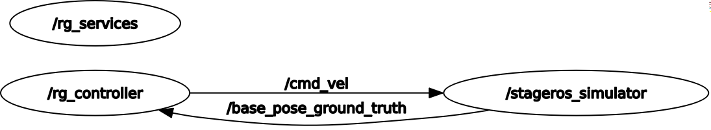

# README - RT1 - Assignment 1 - Robot Game

**Francesco Ganci - 4143910** - Robotics Engineering - A.A. 2020/2021

*Thanks to prof. Carmine Recchiuto for having provded the simulation environment.*

> Take a look at the video demo of the project!
> - [video demo Here!](https://drive.google.com/file/d/1cjAK4hsfgXw_uhdD6VYQhKxnCjhM49gN/view?usp=sharing)
> 
> Doxygen Documentation: 
> - [Doxygen Documentation here](https://programmatoroseduto.github.io/RT1_assignment_1/)
> - better: **branch *gh-pages***, download from there.

## How to set up the project

### Prerequisites

The only dependency you need in order to run the project is *stage_ros*, a little 2d simulator for an holonomc robot. You can find more informations online in the [official ROS Wiki](http://wiki.ros.org/stage_ros). However, it is already installed by default in ROS noetic, so you don't have to worry about it. 

You don't need anything else in order to run this project. 

### Compatibility

The project is compatible with both **ROS Noetic** and **ROS Kinetic**. 

### Set-Up

The repository contains only one package, named *robot_game*. Installing it is simple: go into your preferred workspace (I suggest you to use an empty workspace), folder *src*, and from there launch the following command:

```bash
git clone https://github.com/programmatoroSeduto/RT1_assignment_1.git -b main robot_game
```

Done this, remember to compile the project: simply launch `catkin_make` from the root of your workspace. Restart the console, and you're ready.

You could face problems in finding .py nodes; **make sure that all the files in the /scripts folder are executable**. 


## How to run the project

This project was implemented in two versions: the first one in C++, and the second one in Python. 

### Manually run the project

Before launching any of the two available versions, remember to launch the *stage_ros* simulator. The world file is already in the package.

```bash
rosrun stage_ros stageros $(find robot_game)/world/exercise.world &
```

*C++ version*:

```bash
rosrun robot_game rg_services
rosrun robot_game rg_controller
```

*Python version*: sumply add `_py.py` at the end of the names. 

```bash
rosrun robot_game rg_services_py.py
rosrun robot_game rg_controller_py.py
```

### Run the project with RosLaunch

Using `roslaunch` you don't need to start the simulation environment before. 

*C++ version:*

```bash
roslaunch robot_game robot_gambe_cpp.launch
```

*Python version:*

```bash
roslaunch robot_game robot_gambe_py.launch
```

## Structure of the project

### Package File System

Here are the significant folders inside this package:

- **scripts** python scripts
- **src** c++ code
- **include/robot_game** contains a configuration file (in python) useful for the python versione of the project
- **docs** some documentation
- **launch** the two launch files
- **srv** contains the definitions of the three services used in this project. 
- **world** contiains only one file *.wolrd* that is the description of the environment of the robot. 

### Architecture of the project

Both the versions have the same structure: two nodes, 

- the first one provides all the service the controller needs, *rg_services*
- the secondo one interacts with the simulation for controlling the robot, *rg_controller*

See this RosGraph:



The node labeled *rg_controller* reads the actual position from the topic */base_pose_ground_truth*, performs some computation generating a twist, and sends it through the topic */cmd_vel*. 

The other node, *rg_services*, provides these services to the controller:

- **/rg_get_target_srv** : generate a random target
- **/rg_check_target** : check if the robot is located *clone enough* to the goal position
- **/rg_get_vel_srv** : generate a linear velocity (as twist9 such that the robot can get closer to the goal

The proposed algorithm works under the assumption that the world is completely free, that is there are no obstacles. 
